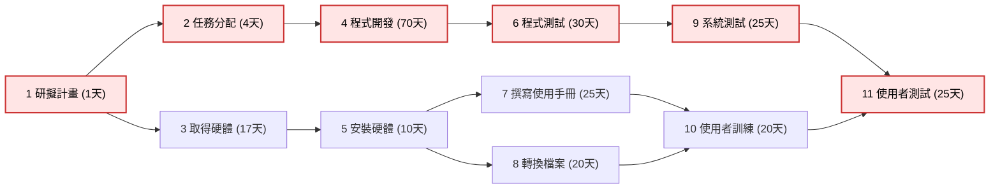
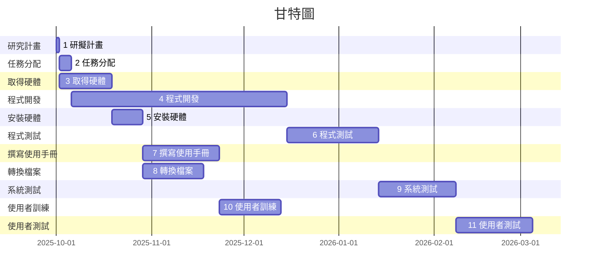

 
(1)PERT/CPM 圖 (3)關鍵路徑(以紅色表示)

```mermaid
flowchart LR
    %% 任務節點 (Activity-on-Node)
    T1["1 研擬計畫 (1天)"]
    T2["2 任務分配 (4天)"]
    T3["3 取得硬體 (17天)"]
    T4["4 程式開發 (70天)"]
    T5["5 安裝硬體 (10天)"]
    T6["6 程式測試 (30天)"]
    T7["7 撰寫使用手冊 (25天)"]
    T8["8 轉換檔案 (20天)"]
    T9["9 系統測試 (25天)"]
    T10["10 使用者訓練 (20天)"]
    T11["11 使用者測試 (25天)"]

    %% 前置關係
    T1 --> T2
    T1 --> T3
    T2 --> T4
    T3 --> T5
    T4 --> T6
    T5 --> T7
    T5 --> T8
    T6 --> T9
    T7 --> T10
    T8 --> T10
    T9 --> T11
    T10 --> T11

    %% 關鍵路徑標示：1→2→4→6→9→11
    classDef critical fill:#ffe5e5,stroke:#c33,stroke-width:2px,color:#000;
    class T1,T2,T4,T6,T9,T11 critical;

```

(2)甘特圖

```mermaid
gantt
  dateFormat  YYYY-MM-DD
  title 甘特圖

  section 研究計畫
  1 研擬計畫 :t1, 2025-10-01, 1d

  section 任務分配
  2 任務分配 :t2, after t1, 4d

  section 取得硬體
  3 取得硬體 :t3, after t1, 17d

  section 程式開發
  4 程式開發 :t4, after t2, 70d

  section 安裝硬體
  5 安裝硬體 :t5, after t3, 10d

  section 程式測試
  6 程式測試 :t6, after t4, 30d

  section 撰寫使用手冊
  7 撰寫使用手冊 :t7, after t5, 25d

  section 轉換檔案
  8 轉換檔案 :t8, after t5, 20d

  section 系統測試
  9 系統測試 :t9, after t6, 25d

  section 使用者訓練
  10 使用者訓練 :t10, after t7 t8, 20d

  section 使用者測試
  11 使用者測試 :t11, after t9 t10, 25d

```
